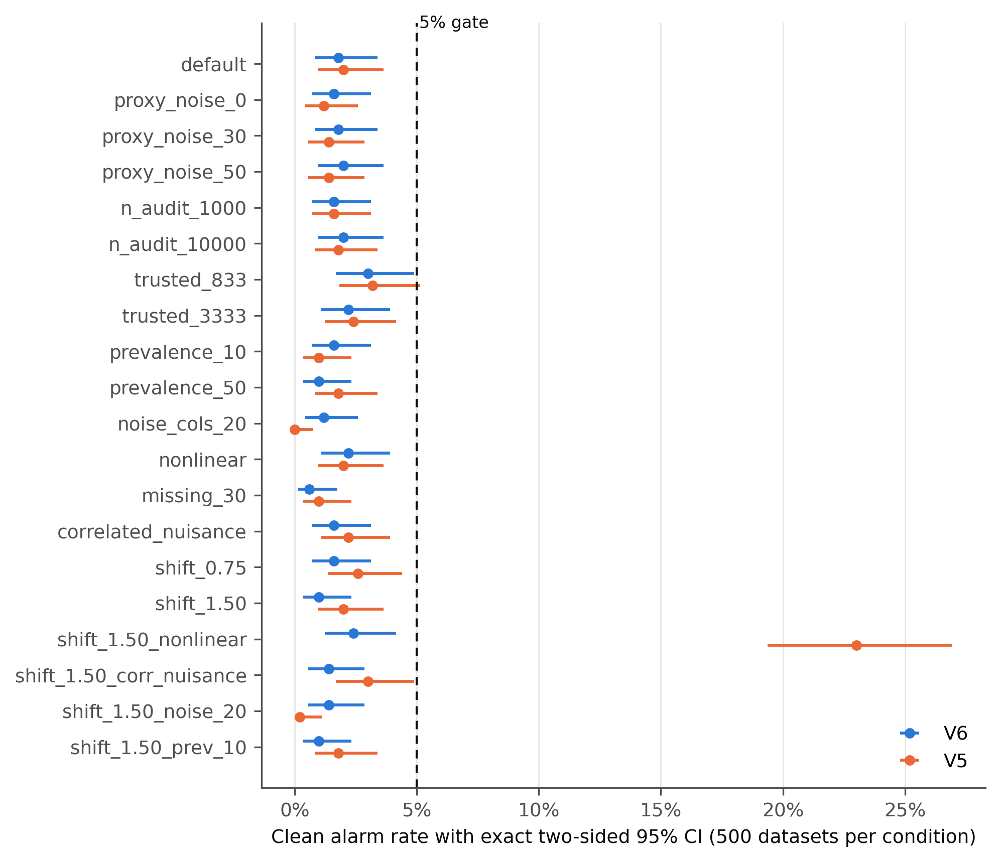
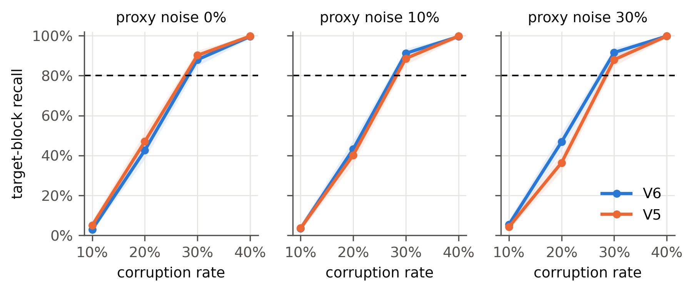
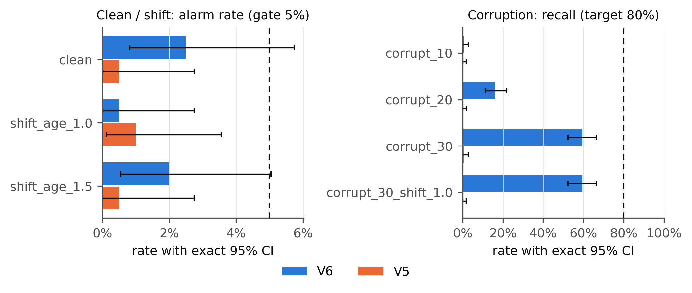
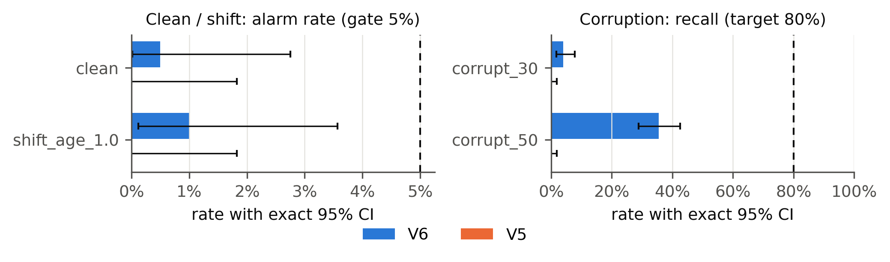
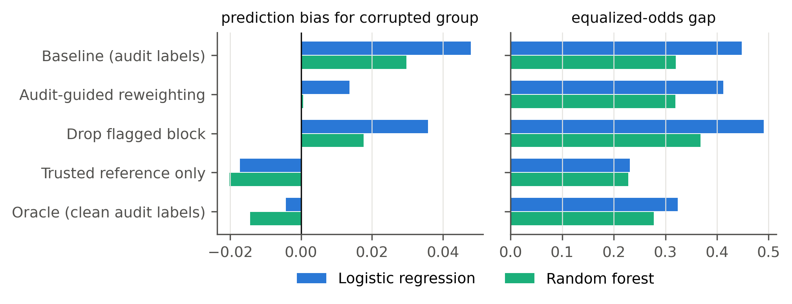
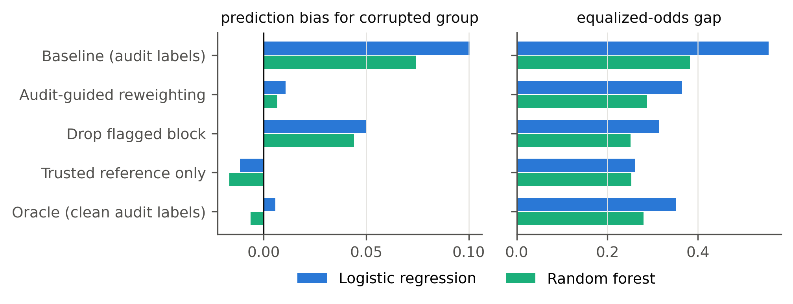
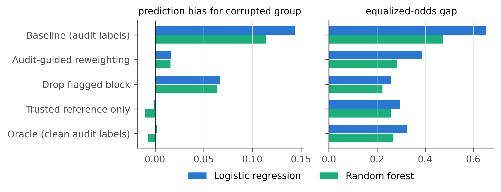
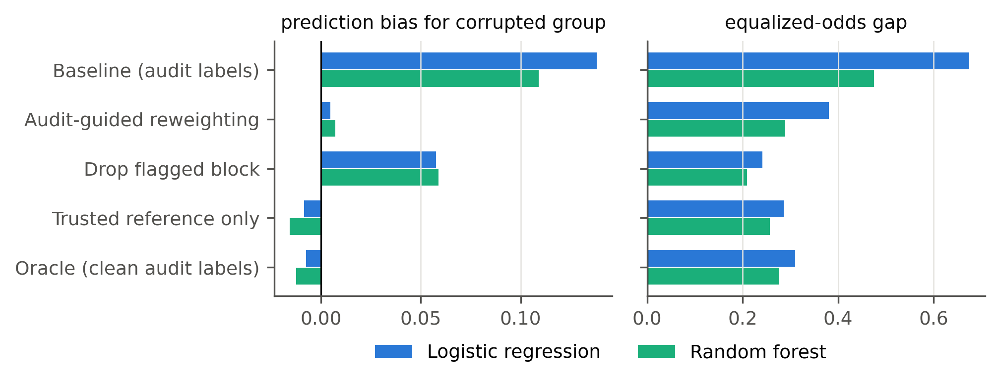
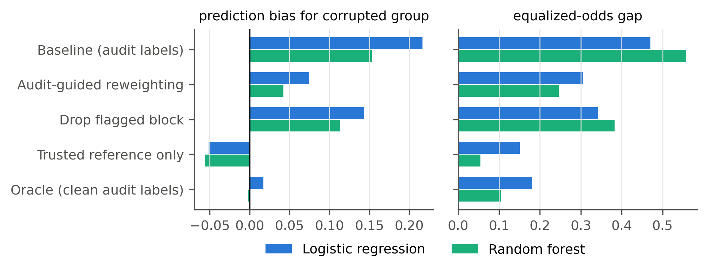
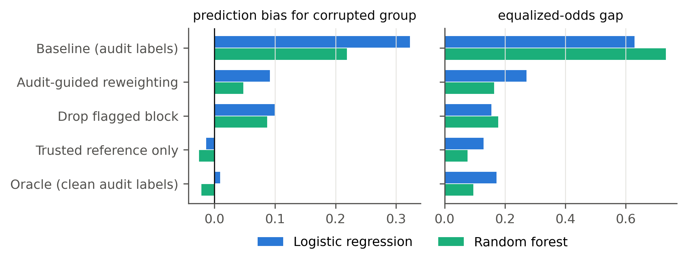

# Results of the reimplemented auditors

Auto-generated by `experiments/make_report.py` from the CSV files in `results/`. These are results of this repository's independent reimplementation of the V5 and V6 auditors from the project's written method; they are **not** the archived V1–V6 study numbers and should be reported as a separate study.

**Protocol notes (for honest reporting).** The V5/V6 code, gates and condition list were written before the main runs. A 100-repetition development pilot on four conditions (default, shift 1.50, nonlinear, shift 1.50 + nonlinear) was run first. After the pilot, two trusted-sample-size conditions (833 and 3,333) were added, and no auditor code was changed. Seeds are deterministic (`experiments/run_study.py`), so the pilot reused some main-study streams for those conditions. The condition set was chosen by this project, and these runs are not a locked, independent confirmation study.

## 1. Calibration (no corruption)

10,500 synthetic datasets (500 per condition), every method on the same data, V5 with B = 1999 permutations. Gate: exact two-sided 95% upper bound < 5% in every clean condition; random-label abstention lower bound ≥ 90%.

- **V5**: 18/20 clean conditions pass; alarm rates 0.00%–23.00%; largest upper bound 26.94%.
- **V6**: 20/20 clean conditions pass; alarm rates 0.60%–3.00%; largest upper bound 4.90%.
- **V6** random labels: abstained 495/500 (lower bound 97.68%) → pass.
- **V5** random labels: abstained 496/500 (lower bound 97.96%) → pass.

| condition | method | endpoint | count | runs | rate | 95% CI | gate |
|---|---|---|---|---|---|---|---|
| default | V6 | clean_alarm | 9 | 500 | 1.80% | [0.83%, 3.39%] | pass |
| default | V5 | clean_alarm | 10 | 500 | 2.00% | [0.96%, 3.65%] | pass |
| proxy_noise_0 | V6 | clean_alarm | 8 | 500 | 1.60% | [0.69%, 3.13%] | pass |
| proxy_noise_0 | V5 | clean_alarm | 6 | 500 | 1.20% | [0.44%, 2.59%] | pass |
| proxy_noise_30 | V6 | clean_alarm | 9 | 500 | 1.80% | [0.83%, 3.39%] | pass |
| proxy_noise_30 | V5 | clean_alarm | 7 | 500 | 1.40% | [0.56%, 2.86%] | pass |
| proxy_noise_50 | V6 | clean_alarm | 10 | 500 | 2.00% | [0.96%, 3.65%] | pass |
| proxy_noise_50 | V5 | clean_alarm | 7 | 500 | 1.40% | [0.56%, 2.86%] | pass |
| n_audit_1000 | V6 | clean_alarm | 8 | 500 | 1.60% | [0.69%, 3.13%] | pass |
| n_audit_1000 | V5 | clean_alarm | 8 | 500 | 1.60% | [0.69%, 3.13%] | pass |
| n_audit_10000 | V6 | clean_alarm | 10 | 500 | 2.00% | [0.96%, 3.65%] | pass |
| n_audit_10000 | V5 | clean_alarm | 9 | 500 | 1.80% | [0.83%, 3.39%] | pass |
| trusted_833 | V6 | clean_alarm | 15 | 500 | 3.00% | [1.69%, 4.90%] | pass |
| trusted_833 | V5 | clean_alarm | 16 | 500 | 3.20% | [1.84%, 5.14%] | FAIL |
| trusted_3333 | V6 | clean_alarm | 11 | 500 | 2.20% | [1.10%, 3.90%] | pass |
| trusted_3333 | V5 | clean_alarm | 12 | 500 | 2.40% | [1.25%, 4.15%] | pass |
| prevalence_10 | V6 | clean_alarm | 8 | 500 | 1.60% | [0.69%, 3.13%] | pass |
| prevalence_10 | V5 | clean_alarm | 5 | 500 | 1.00% | [0.33%, 2.32%] | pass |
| prevalence_50 | V6 | clean_alarm | 5 | 500 | 1.00% | [0.33%, 2.32%] | pass |
| prevalence_50 | V5 | clean_alarm | 9 | 500 | 1.80% | [0.83%, 3.39%] | pass |
| noise_cols_20 | V6 | clean_alarm | 6 | 500 | 1.20% | [0.44%, 2.59%] | pass |
| noise_cols_20 | V5 | clean_alarm | 0 | 500 | 0.00% | [0.00%, 0.74%] | pass |
| nonlinear | V6 | clean_alarm | 11 | 500 | 2.20% | [1.10%, 3.90%] | pass |
| nonlinear | V5 | clean_alarm | 10 | 500 | 2.00% | [0.96%, 3.65%] | pass |
| missing_30 | V6 | clean_alarm | 3 | 500 | 0.60% | [0.12%, 1.74%] | pass |
| missing_30 | V5 | clean_alarm | 5 | 500 | 1.00% | [0.33%, 2.32%] | pass |
| correlated_nuisance | V6 | clean_alarm | 8 | 500 | 1.60% | [0.69%, 3.13%] | pass |
| correlated_nuisance | V5 | clean_alarm | 11 | 500 | 2.20% | [1.10%, 3.90%] | pass |
| shift_0.75 | V6 | clean_alarm | 8 | 500 | 1.60% | [0.69%, 3.13%] | pass |
| shift_0.75 | V5 | clean_alarm | 13 | 500 | 2.60% | [1.39%, 4.41%] | pass |
| shift_1.50 | V6 | clean_alarm | 5 | 500 | 1.00% | [0.33%, 2.32%] | pass |
| shift_1.50 | V5 | clean_alarm | 10 | 500 | 2.00% | [0.96%, 3.65%] | pass |
| shift_1.50_nonlinear | V6 | clean_alarm | 12 | 500 | 2.40% | [1.25%, 4.15%] | pass |
| shift_1.50_nonlinear | V5 | clean_alarm | 115 | 500 | 23.00% | [19.38%, 26.94%] | FAIL |
| shift_1.50_corr_nuisance | V6 | clean_alarm | 7 | 500 | 1.40% | [0.56%, 2.86%] | pass |
| shift_1.50_corr_nuisance | V5 | clean_alarm | 15 | 500 | 3.00% | [1.69%, 4.90%] | pass |
| shift_1.50_noise_20 | V6 | clean_alarm | 7 | 500 | 1.40% | [0.56%, 2.86%] | pass |
| shift_1.50_noise_20 | V5 | clean_alarm | 1 | 500 | 0.20% | [0.01%, 1.11%] | pass |
| shift_1.50_prev_10 | V6 | clean_alarm | 5 | 500 | 1.00% | [0.33%, 2.32%] | pass |
| shift_1.50_prev_10 | V5 | clean_alarm | 9 | 500 | 1.80% | [0.83%, 3.39%] | pass |
| random_labels | V6 | abstention | 495 | 500 | 99.00% | [97.68%, 99.67%] | pass |
| random_labels | V5 | abstention | 496 | 500 | 99.20% | [97.96%, 99.78%] | pass |

## 2. Power (corruption injected)

Recall = share of datasets in which the block containing the injected group `a` is selected. Off-target = share in which some other block is also selected. Exploratory: the protocol requires every calibration gate to pass before power is interpreted.

| condition | method | count | runs | recall | 95% CI | ≥80% | off-target |
|---|---|---|---|---|---|---|---|
| c10_noise0 | V6 | 15 | 500 | 3.00% | [1.69%, 4.90%] | no | 1.60% |
| c10_noise0 | V5 | 25 | 500 | 5.00% | [3.26%, 7.29%] | no | 1.80% |
| c10_noise10 | V6 | 17 | 500 | 3.40% | [1.99%, 5.39%] | no | 1.00% |
| c10_noise10 | V5 | 18 | 500 | 3.60% | [2.15%, 5.63%] | no | 1.00% |
| c10_noise30 | V6 | 27 | 500 | 5.40% | [3.59%, 7.76%] | no | 2.20% |
| c10_noise30 | V5 | 21 | 500 | 4.20% | [2.62%, 6.35%] | no | 1.40% |
| c20_noise0 | V6 | 213 | 500 | 42.60% | [38.22%, 47.07%] | no | 2.60% |
| c20_noise0 | V5 | 235 | 500 | 47.00% | [42.55%, 51.48%] | no | 1.80% |
| c20_noise10 | V6 | 216 | 500 | 43.20% | [38.81%, 47.67%] | no | 2.40% |
| c20_noise10 | V5 | 201 | 500 | 40.20% | [35.87%, 44.65%] | no | 2.40% |
| c20_noise30 | V6 | 234 | 500 | 46.80% | [42.36%, 51.28%] | no | 4.40% |
| c20_noise30 | V5 | 182 | 500 | 36.40% | [32.17%, 40.79%] | no | 4.40% |
| c30_noise0 | V6 | 440 | 500 | 88.00% | [84.82%, 90.72%] | yes | 4.00% |
| c30_noise0 | V5 | 451 | 500 | 90.20% | [87.25%, 92.66%] | yes | 3.60% |
| c30_noise10 | V6 | 456 | 500 | 91.20% | [88.37%, 93.53%] | yes | 3.60% |
| c30_noise10 | V5 | 443 | 500 | 88.60% | [85.48%, 91.25%] | yes | 2.60% |
| c30_noise30 | V6 | 458 | 500 | 91.60% | [88.82%, 93.88%] | yes | 10.00% |
| c30_noise30 | V5 | 440 | 500 | 88.00% | [84.82%, 90.72%] | yes | 7.80% |
| c40_noise0 | V6 | 498 | 500 | 99.60% | [98.56%, 99.95%] | yes | 4.80% |
| c40_noise0 | V5 | 499 | 500 | 99.80% | [98.89%, 99.99%] | yes | 4.00% |
| c40_noise10 | V6 | 498 | 500 | 99.60% | [98.56%, 99.95%] | yes | 5.80% |
| c40_noise10 | V5 | 499 | 500 | 99.80% | [98.89%, 99.99%] | yes | 3.40% |
| c40_noise30 | V6 | 499 | 500 | 99.80% | [98.89%, 99.99%] | yes | 24.60% |
| c40_noise30 | V5 | 499 | 500 | 99.80% | [98.89%, 99.99%] | yes | 17.20% |
| c30_shift150 | V6 | 408 | 500 | 81.60% | [77.92%, 84.90%] | yes | 3.20% |
| c30_shift150 | V5 | 467 | 500 | 93.40% | [90.86%, 95.41%] | yes | 3.80% |
| c30_n10000 | V6 | 500 | 500 | 100.00% | [99.26%, 100.00%] | yes | 5.00% |
| c30_n10000 | V5 | 500 | 500 | 100.00% | [99.26%, 100.00%] | yes | 3.60% |
| c20_n10000 | V6 | 419 | 500 | 83.80% | [80.27%, 86.92%] | yes | 3.40% |
| c20_n10000 | V5 | 406 | 500 | 81.20% | [77.49%, 84.53%] | yes | 3.00% |

## 3. Real-data transfer (semi-synthetic)

2,200 record-disjoint random splits (200 per condition). Clean and shift rows report alarm rates; corrupt rows report recall of the corrupted attribute.

### COMPAS

| condition | method | endpoint | count | runs | rate | 95% CI |
|---|---|---|---|---|---|---|
| clean | V6 | clean_alarm | 5 | 200 | 2.50% | [0.82%, 5.74%] |
| clean | V5 | clean_alarm | 1 | 200 | 0.50% | [0.01%, 2.75%] |
| shift_age_1.0 | V6 | clean_alarm | 1 | 200 | 0.50% | [0.01%, 2.75%] |
| shift_age_1.0 | V5 | clean_alarm | 2 | 200 | 1.00% | [0.12%, 3.57%] |
| shift_age_1.5 | V6 | clean_alarm | 4 | 200 | 2.00% | [0.55%, 5.04%] |
| shift_age_1.5 | V5 | clean_alarm | 1 | 200 | 0.50% | [0.01%, 2.75%] |
| corrupt_10 | V6 | target_recall | 1 | 200 | 0.50% | [0.01%, 2.75%] |
| corrupt_10 | V5 | target_recall | 0 | 200 | 0.00% | [0.00%, 1.83%] |
| corrupt_20 | V6 | target_recall | 32 | 200 | 16.00% | [11.21%, 21.83%] |
| corrupt_20 | V5 | target_recall | 0 | 200 | 0.00% | [0.00%, 1.83%] |
| corrupt_30 | V6 | target_recall | 119 | 200 | 59.50% | [52.35%, 66.37%] |
| corrupt_30 | V5 | target_recall | 1 | 200 | 0.50% | [0.01%, 2.75%] |
| corrupt_30_shift_1.0 | V6 | target_recall | 119 | 200 | 59.50% | [52.35%, 66.37%] |
| corrupt_30_shift_1.0 | V5 | target_recall | 0 | 200 | 0.00% | [0.00%, 1.83%] |

### German Credit

| condition | method | endpoint | count | runs | rate | 95% CI |
|---|---|---|---|---|---|---|
| clean | V6 | clean_alarm | 1 | 200 | 0.50% | [0.01%, 2.75%] |
| clean | V5 | clean_alarm | 0 | 200 | 0.00% | [0.00%, 1.83%] |
| shift_age_1.0 | V6 | clean_alarm | 2 | 200 | 1.00% | [0.12%, 3.57%] |
| shift_age_1.0 | V5 | clean_alarm | 0 | 200 | 0.00% | [0.00%, 1.83%] |
| corrupt_30 | V6 | target_recall | 8 | 200 | 4.00% | [1.74%, 7.73%] |
| corrupt_30 | V5 | target_recall | 0 | 200 | 0.00% | [0.00%, 1.83%] |
| corrupt_50 | V6 | target_recall | 71 | 200 | 35.50% | [28.88%, 42.56%] |
| corrupt_50 | V5 | target_recall | 0 | 200 | 0.00% | [0.00%, 1.83%] |

## 4. Audit-guided mitigation (only in splits where V6 flagged)

Means over flagged splits; fairness measured on clean held-out test labels for the corrupted group. `share_meeting_criteria` = fraction of splits where reweighting lowered the EO gap, lost ≤ 0.02 AUC and kept ESS ≥ 70%.

### COMPAS · corrupt_10

| strategy | model | reps | auc | eo_gap | dp_gap | group_pred_bias | auc_change | eo_gap_change | share_meeting_criteria |
|---|---|---|---|---|---|---|---|---|---|
| Baseline (audit labels) | Logistic regression | 5 | 0.726 | 0.448 | 0.441 | 0.048 | 0.0 | 0.0 | 0.6 |
| Baseline (audit labels) | Random forest | 5 | 0.725 | 0.32 | 0.331 | 0.03 | 0.0 | 0.0 | 0.6 |
| Audit-guided reweighting | Logistic regression | 5 | 0.727 | 0.412 | 0.381 | 0.014 | 0.001 | -0.036 | 0.6 |
| Audit-guided reweighting | Random forest | 5 | 0.725 | 0.32 | 0.309 | 0.001 | 0.0 | -0.001 | 0.6 |
| Drop flagged block | Logistic regression | 5 | 0.682 | 0.491 | 0.488 | 0.036 | -0.044 | 0.043 | 0.6 |
| Drop flagged block | Random forest | 5 | 0.676 | 0.368 | 0.372 | 0.018 | -0.049 | 0.048 | 0.6 |
| Trusted reference only | Logistic regression | 5 | 0.728 | 0.231 | 0.224 | -0.017 | 0.002 | -0.217 | 0.6 |
| Trusted reference only | Random forest | 5 | 0.726 | 0.228 | 0.242 | -0.02 | 0.001 | -0.092 | 0.6 |
| Oracle (clean audit labels) | Logistic regression | 5 | 0.729 | 0.324 | 0.304 | -0.004 | 0.003 | -0.124 | 0.6 |
| Oracle (clean audit labels) | Random forest | 5 | 0.728 | 0.277 | 0.277 | -0.014 | 0.003 | -0.043 | 0.6 |

### COMPAS · corrupt_20

| strategy | model | reps | auc | eo_gap | dp_gap | group_pred_bias | auc_change | eo_gap_change | share_meeting_criteria |
|---|---|---|---|---|---|---|---|---|---|
| Baseline (audit labels) | Logistic regression | 39 | 0.713 | 0.556 | 0.563 | 0.101 | 0.0 | 0.0 | 0.821 |
| Baseline (audit labels) | Random forest | 39 | 0.717 | 0.383 | 0.397 | 0.074 | 0.0 | 0.0 | 0.846 |
| Audit-guided reweighting | Logistic regression | 39 | 0.723 | 0.365 | 0.334 | 0.011 | 0.01 | -0.191 | 0.821 |
| Audit-guided reweighting | Random forest | 39 | 0.721 | 0.287 | 0.277 | 0.007 | 0.004 | -0.095 | 0.846 |
| Drop flagged block | Logistic regression | 39 | 0.723 | 0.315 | 0.319 | 0.05 | 0.01 | -0.241 | 0.821 |
| Drop flagged block | Random forest | 39 | 0.716 | 0.251 | 0.266 | 0.044 | -0.001 | -0.131 | 0.846 |
| Trusted reference only | Logistic regression | 39 | 0.725 | 0.261 | 0.238 | -0.012 | 0.012 | -0.295 | 0.821 |
| Trusted reference only | Random forest | 39 | 0.723 | 0.253 | 0.245 | -0.017 | 0.006 | -0.13 | 0.846 |
| Oracle (clean audit labels) | Logistic regression | 39 | 0.725 | 0.351 | 0.318 | 0.006 | 0.013 | -0.205 | 0.821 |
| Oracle (clean audit labels) | Random forest | 39 | 0.724 | 0.28 | 0.266 | -0.006 | 0.008 | -0.103 | 0.846 |

### COMPAS · corrupt_30

| strategy | model | reps | auc | eo_gap | dp_gap | group_pred_bias | auc_change | eo_gap_change | share_meeting_criteria |
|---|---|---|---|---|---|---|---|---|---|
| Baseline (audit labels) | Logistic regression | 122 | 0.706 | 0.652 | 0.65 | 0.143 | 0.0 | 0.0 | 0.975 |
| Baseline (audit labels) | Random forest | 122 | 0.712 | 0.474 | 0.481 | 0.114 | 0.0 | 0.0 | 0.984 |
| Audit-guided reweighting | Logistic regression | 122 | 0.723 | 0.387 | 0.355 | 0.016 | 0.016 | -0.265 | 0.975 |
| Audit-guided reweighting | Random forest | 122 | 0.72 | 0.284 | 0.284 | 0.016 | 0.008 | -0.19 | 0.984 |
| Drop flagged block | Logistic regression | 122 | 0.727 | 0.258 | 0.275 | 0.067 | 0.02 | -0.394 | 0.975 |
| Drop flagged block | Random forest | 122 | 0.716 | 0.223 | 0.243 | 0.064 | 0.004 | -0.251 | 0.984 |
| Trusted reference only | Logistic regression | 122 | 0.724 | 0.295 | 0.269 | -0.001 | 0.018 | -0.357 | 0.975 |
| Trusted reference only | Random forest | 122 | 0.722 | 0.258 | 0.25 | -0.01 | 0.01 | -0.216 | 0.984 |
| Oracle (clean audit labels) | Logistic regression | 122 | 0.726 | 0.324 | 0.296 | 0.002 | 0.019 | -0.328 | 0.975 |
| Oracle (clean audit labels) | Random forest | 122 | 0.724 | 0.266 | 0.258 | -0.007 | 0.012 | -0.208 | 0.984 |

### COMPAS · corrupt_30_shift_1.0

| strategy | model | reps | auc | eo_gap | dp_gap | group_pred_bias | auc_change | eo_gap_change | share_meeting_criteria |
|---|---|---|---|---|---|---|---|---|---|
| Baseline (audit labels) | Logistic regression | 119 | 0.704 | 0.674 | 0.672 | 0.138 | 0.0 | 0.0 | 1.0 |
| Baseline (audit labels) | Random forest | 119 | 0.71 | 0.475 | 0.485 | 0.109 | 0.0 | 0.0 | 1.0 |
| Audit-guided reweighting | Logistic regression | 119 | 0.722 | 0.381 | 0.338 | 0.005 | 0.018 | -0.293 | 1.0 |
| Audit-guided reweighting | Random forest | 119 | 0.719 | 0.29 | 0.28 | 0.007 | 0.008 | -0.185 | 1.0 |
| Drop flagged block | Logistic regression | 119 | 0.727 | 0.242 | 0.26 | 0.058 | 0.023 | -0.432 | 1.0 |
| Drop flagged block | Random forest | 119 | 0.716 | 0.209 | 0.232 | 0.059 | 0.005 | -0.266 | 1.0 |
| Trusted reference only | Logistic regression | 119 | 0.724 | 0.286 | 0.258 | -0.008 | 0.02 | -0.389 | 1.0 |
| Trusted reference only | Random forest | 119 | 0.722 | 0.257 | 0.246 | -0.016 | 0.012 | -0.218 | 1.0 |
| Oracle (clean audit labels) | Logistic regression | 119 | 0.725 | 0.31 | 0.276 | -0.007 | 0.02 | -0.365 | 1.0 |
| Oracle (clean audit labels) | Random forest | 119 | 0.723 | 0.277 | 0.263 | -0.013 | 0.012 | -0.198 | 1.0 |

### German Credit · corrupt_30

| strategy | model | reps | auc | eo_gap | dp_gap | group_pred_bias | auc_change | eo_gap_change | share_meeting_criteria |
|---|---|---|---|---|---|---|---|---|---|
| Baseline (audit labels) | Logistic regression | 15 | 0.755 | 0.471 | 0.416 | 0.217 | 0.0 | 0.0 | 0.867 |
| Baseline (audit labels) | Random forest | 15 | 0.737 | 0.558 | 0.433 | 0.153 | 0.0 | 0.0 | 0.933 |
| Audit-guided reweighting | Logistic regression | 15 | 0.763 | 0.306 | 0.232 | 0.075 | 0.008 | -0.165 | 0.867 |
| Audit-guided reweighting | Random forest | 15 | 0.756 | 0.246 | 0.158 | 0.042 | 0.019 | -0.312 | 0.933 |
| Drop flagged block | Logistic regression | 15 | 0.757 | 0.342 | 0.277 | 0.144 | 0.002 | -0.129 | 0.867 |
| Drop flagged block | Random forest | 15 | 0.746 | 0.383 | 0.295 | 0.113 | 0.01 | -0.175 | 0.933 |
| Trusted reference only | Logistic regression | 15 | 0.754 | 0.151 | 0.077 | -0.051 | -0.001 | -0.32 | 0.867 |
| Trusted reference only | Random forest | 15 | 0.753 | 0.054 | 0.024 | -0.056 | 0.016 | -0.504 | 0.933 |
| Oracle (clean audit labels) | Logistic regression | 15 | 0.781 | 0.181 | 0.119 | 0.017 | 0.025 | -0.29 | 0.867 |
| Oracle (clean audit labels) | Random forest | 15 | 0.776 | 0.105 | 0.066 | -0.002 | 0.039 | -0.453 | 0.933 |

### German Credit · corrupt_50

| strategy | model | reps | auc | eo_gap | dp_gap | group_pred_bias | auc_change | eo_gap_change | share_meeting_criteria |
|---|---|---|---|---|---|---|---|---|---|
| Baseline (audit labels) | Logistic regression | 72 | 0.718 | 0.63 | 0.604 | 0.323 | 0.0 | 0.0 | 1.0 |
| Baseline (audit labels) | Random forest | 72 | 0.7 | 0.732 | 0.678 | 0.219 | 0.0 | 0.0 | 1.0 |
| Audit-guided reweighting | Logistic regression | 72 | 0.747 | 0.271 | 0.211 | 0.091 | 0.029 | -0.359 | 1.0 |
| Audit-guided reweighting | Random forest | 72 | 0.75 | 0.164 | 0.1 | 0.047 | 0.05 | -0.569 | 1.0 |
| Drop flagged block | Logistic regression | 72 | 0.735 | 0.155 | 0.107 | 0.099 | 0.018 | -0.475 | 1.0 |
| Drop flagged block | Random forest | 72 | 0.742 | 0.178 | 0.133 | 0.087 | 0.042 | -0.555 | 1.0 |
| Trusted reference only | Logistic regression | 72 | 0.748 | 0.129 | 0.078 | -0.014 | 0.031 | -0.5 | 1.0 |
| Trusted reference only | Random forest | 72 | 0.75 | 0.076 | 0.034 | -0.026 | 0.05 | -0.657 | 1.0 |
| Oracle (clean audit labels) | Logistic regression | 72 | 0.767 | 0.172 | 0.118 | 0.009 | 0.049 | -0.457 | 1.0 |
| Oracle (clean audit labels) | Random forest | 72 | 0.765 | 0.095 | 0.043 | -0.022 | 0.065 | -0.638 | 1.0 |
